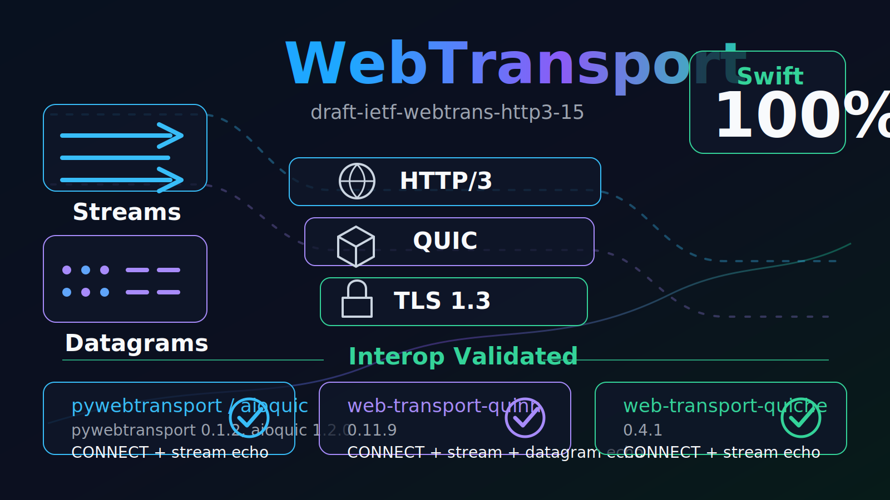

# WebTransport

Native WebTransport over HTTP/3 implementations.

Latest official HTTP/3 draft target: `draft-ietf-webtrans-http3-15`.

Datatracker: <https://datatracker.ietf.org/doc/draft-ietf-webtrans-http3/>

## Status

| Implementation | Draft compatibility | Status |
| --- | ---: | --- |
| Swift | 100% | Production SwiftPM package and CLI apps. |
| C99 | 0% | Planned. No protocol implementation yet. |
| C++ (`CPP`) | 0% | Planned. No protocol implementation yet. |

License: MIT.

## Swift

The Swift implementation is the active implementation and is exposed as a normal Swift package from the repository root:

```swift
.package(url: "https://github.com/Pummelchen/WebTransport.git", branch: "main")
```

Products:

- `WebTransport`
- `WebTransportNetworkRuntime`
- `WebTransportHTTP3Core`
- `WebTransportQUICCore`
- `WebTransportTLSCore`
- `WebTransportCryptoApple`
- `WebTransportUDPApple`
- `WebTransportClient`
- `WebTransportServer`

Minimal client example:

```swift
import Foundation
import WebTransport

let client = WebTransportClient(configuration: WebTransportClientConfiguration(
    authority: "example.com",
    path: "/wt",
    origin: "https://example.com",
    availableProtocols: ["demo.v1"]
))

let session = try await client.connect(to: WebTransportEndpoint(host: "example.com", port: 443))
let stream = try await session.openBidirectionalStream()
try await stream.send(Data("hello".utf8), endOfStream: true)
let response = try await stream.receive()
```

Validation against independent WebTransport implementations:

| Implementation | Version | URL | Proof |
| --- | --- | --- | --- |
| pywebtransport / aioquic | pywebtransport 0.1.2, aioquic 1.2.0 | <https://pypi.org/project/pywebtransport/> | HTTP/3 CONNECT + stream echo |
| web-transport-quinn | 0.11.9 | <https://crates.io/crates/web-transport-quinn/0.11.9> | HTTP/3 CONNECT + stream echo + QUIC DATAGRAM echo |
| web-transport-quiche | 0.4.1 | <https://crates.io/crates/web-transport-quiche/0.4.1> | HTTP/3 CONNECT + stream echo |

The current proof is generated by:

```sh
cd Swift && ./run-third-party-interop.sh
```

Core local checks:

```sh
swift build
swift test
swift run WebTransportClient --scenario all
swift run WebTransportServer --scenario all
```

Release checks:

```sh
cd Swift && ./check-api-compatibility.sh
cd Swift && ./build-release-apple-silicon.sh
```

## Public Launch Checklist

Done:

- MIT `LICENSE` file.
- Root SwiftPM package.
- Short API usage example.
- `SECURITY.md` vulnerability reporting policy.
- `CHANGELOG.md`.
- Local build/test/release validation.
- External interop validation against independent WebTransport implementations.

Remaining before a polished public release:

- Create a semantic version tag, for example `1.0.0`, so SwiftPM users do not need `branch: "main"`.
- Add a GitHub Release with release artifacts and checksums.
- Confirm GitHub Actions is green on the remote.
- Optionally add DocC or expand public API comments for generated documentation.

## C99

Planned implementation. The `C99/` directory currently contains documentation and an `Experiments/` folder only.

## C++

Planned implementation. The `CPP/` directory currently contains documentation and an `Experiments/` folder only.
